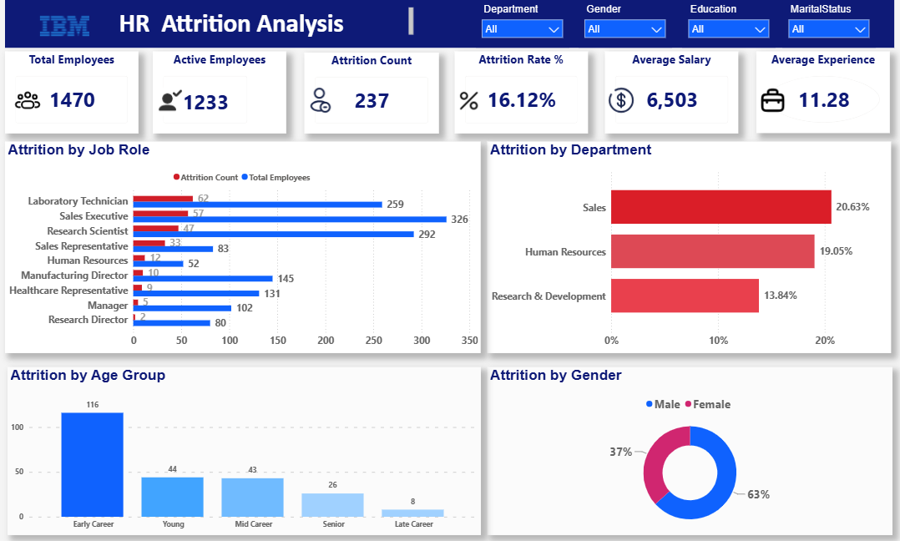
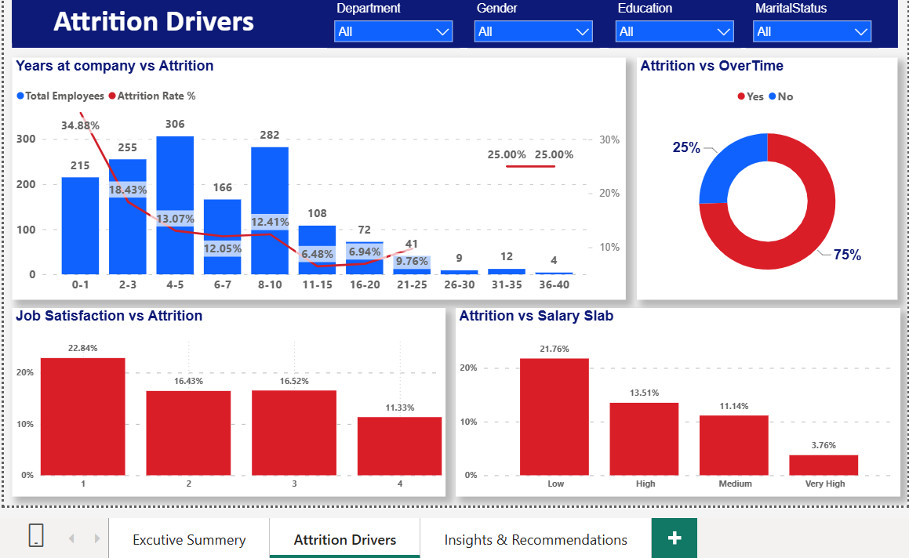
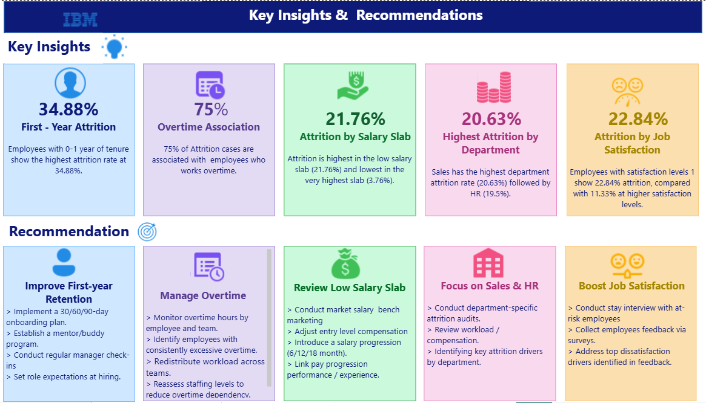

# 📊 IBM HR Employee Attrition Analytics (SQL + Power BI)

## 📌 Project Overview
This project delivers an end-to-end HR Analytics solution designed to solve a critical corporate challenge: **Employee Attrition**. Using the IBM HR dataset (1,470 records), I built a robust data pipeline using **MySQL** for data engineering/transformation and **Power BI** for interactive business storytelling. This project moves beyond basic visualization to uncover the exact workplace factors driving turnover, converting raw corporate data into actionable strategic HR recommendations.

---

## 🎯 Business Problems Addressed
HR leadership needed to shift from reactive reporting to proactive retention planning. This project specifically answers three core business pillars:
1. **Workforce Demographics:** What is the macro state of attrition, and which specific age groups, departments, or job roles show higher turnover trends?
2. **Workplace Strain & Satisfaction:** How do operational factors like sustained Overtime and low Job Satisfaction scores correlate with employees leaving?
3. **Financial & Tenure Impact:** How does compensation (Salary Slabs) affect retention, and why is turnover heavily concentrated among newer employees?

---

## 🗄️ Tech Stack & Data Pipeline
* **Database & SQL Analysis:** MySQL (Data exploration, duplicate validation, and schema checks)
* **Data Transformation:** SQL Queries / Power Query (Centralized transformation logic)
* **Data Visualization & Analytics:** Power BI Desktop & DAX (Advanced business metrics calculations)
* **Version Control:** Git & GitHub

---

## 💻 Data Engineering & SQL Snippets
To optimize dashboard performance, heavy data transformations were handled directly at the database layer using MySQL. Below are the key analytical queries implemented:

### 1. Generating Derived Fields & Analytical Dimensions
```sql
CREATE VIEW v_cleaned_hr_attrition AS
SELECT 
    EmployeeNumber,
    Age,
    Department,
    JobRole,
    MonthlyIncome,
    OverTime,
    JobSatisfaction,
    YearsAtCompany,
    -- Grouping salaries into bands for deep business analysis
    CASE 
        WHEN MonthlyIncome < 5000 THEN 'Low'
        WHEN MonthlyIncome BETWEEN 5000 AND 10000 THEN 'Medium'
        WHEN MonthlyIncome BETWEEN 10001 AND 15000 THEN 'High'
        ELSE 'Very High'
    END AS salary_slab,
    -- Flagging workforce segments based on career stages
    CASE 
        WHEN Age BETWEEN 18 AND 30 THEN 'Early Career'
        WHEN Age BETWEEN 31 AND 45 THEN 'Mid Career'
        ELSE 'Senior'
    END AS age_group
FROM ibm_hr_raw_data;
```

### 2. Job Role Attrition In-Depth Inquiries
```sql
SELECT 
    JobRole,
    COUNT(*) AS total_employees,
    SUM(CASE WHEN Attrition = 'Yes' THEN 1 ELSE 0 END) AS attrition_count,
    ROUND((SUM(CASE WHEN Attrition = 'Yes' THEN 1 ELSE 0 END) / COUNT(*)) * 100, 2) AS attrition_rate
FROM ibm_hr_raw_data
GROUP BY JobRole
ORDER BY attrition_count DESC;
```

---

## 📊 Power BI Data Model
To ensure maximum report speed and clean filter propagation across all pages, the cleaned SQL View was imported into Power BI and structured into a highly efficient **Star Schema Data Model** linking dimensional fields with central employee metrics.

---

## 📸 Dashboard Workflow & Analytical Insights
The report is intentionally designed around a 3-stage business narrative: **Overview → Investigation → Action**.

### 🌐 Page 1: Executive Summary ("What is happening?")
* **Focus:** Macro-level organizational health scorecard.
* **Key Metrics:** Total Employees: **1,470** | Active: **1,233** | Attrition Count: **237** | Attrition Rate: **16.12%** | Average Salary: **\$6,503**
* **Key Visuals:** Attrition broken down by Job Role, Department, Age Group, and Gender.
* **Analytical Insight:** Turnover is heavily concentrated within the **Sales (20.63%)** and **HR (19.05%)** departments. In terms of volume, **Laboratory Technicians (62 cases)** and **Sales Executives (57 cases)** represent the highest risk roles. Attrition also drastically peaks during the **Early Career** age stage.

*()*

---

### 👥 Page 2: Attrition Drivers ("Where and among whom is it concentrated?")
* **Focus:** Deep-dive investigation into behavioral, financial, and workplace friction points.
* **Key Visuals:** Tenure Trend Line, Overtime Donut, Satisfaction Bars, and Salary Slab Distribution.
* **Analytical Insight:** 
  * **First-Year Attrition Danger Zone:** Employees with **0-1 years of tenure show a massive 34.88% attrition rate**, which steadily declines as tenure grows.
  * **The Overtime Impact:** A striking **75% of all attrition cases involve employees who work Overtime**, highlighting severe burnout risk.
  * **Financial Disparity:** Attrition scales with income; the **Low Salary Slab shows a high 21.76% attrition rate**, whereas the Very High slab drops to a stable **3.76%**.
  * **Satisfaction Correlation:** Employees at Job Satisfaction Level 1 suffer from a **22.84% attrition rate**, nearly double the rate of Level 4 employees (11.33%).

*()*

---

### 💡 Page 3: Insights & Action Framework ("What can HR consider doing?")
* **Focus:** Converting observed data patterns into non-causal, data-informed business strategies.

| Problem Area | Data-Informed Pattern Identified | Recommended Strategic HR Action |
| :--- | :--- | :--- |
| **First-Year Retention** | 34.88% Attrition among 0-1 year employees. | Implement a structured **30/60/90-day onboarding plan**, assign peer mentors, and run early manager check-ins. |
| **Overtime Strain** | Overtime is associated with 75% of total attrition cases. | Execute automated workload distribution audits and **reassess staffing levels** to mitigate systemic burnout. |
| **Low Salary Slab** | Low income bracket exhibits a 21.76% attrition spike. | Conduct market salary benchmarking and establish a clear, performance-linked **structured salary progression**. |
| **Sales & HR Friction** | Sales (20.63%) and HR (19.5%) drive departmental attrition. | Conduct department-specific stay interviews to investigate workload, leadership, and unique culture challenges. |
| **Job Satisfaction** | Level 1 satisfaction drives a high 22.84% exit rate. | Gather regular pulse feedback via anonymous surveys to actively **address top workplace dissatisfaction drivers**. |

*()*

---

## 📈 Business Value Delivered
This project acts as an essential corporate decision-support tool rather than a basic charting exercise. It empowers business leaders to:
* Pivot from generic HR retention policies to **highly targeted, data-backed interventions**.
* Prioritize financial and training resources towards high-risk zones (**Early tenure, low salary bands, and high-overtime teams**).
* Protect organization stability by drastically **lowering recruitment and onboarding costs** through optimized employee retention.

---

## 🚀 How to Run the Project
## 🚀 How to Run the Project
1. **Database Setup & SQL Verification:** Navigate to the [sql/](sql/) directory in this repository. Execute the `data_cleaning.sql` and `analysis_queries.sql` files within your local MySQL instance to ingest data, run validations, and generate the underlying schema views.
2. **Dashboard Initialization:** Download the `IBM_HR_Attrition_Analytics.pbix` file located inside the [powerbi/](powerbi/) directory. Open it in Power BI Desktop, click **Refresh** to sync with your local SQL Server instance, and interactively explore the dashboard tracking corporate metrics.

*Developed by Your Name | [LinkedIn Profile](https://www.linkedin.com/in/shahana-sherin-tp-30521b372?utm_source=share_via&utm_content=profile&utm_medium=member_ios)*


